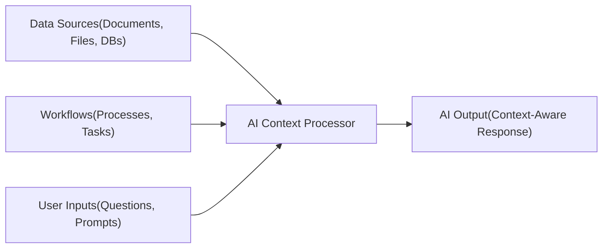

## Overview

AI Context is everything an AI system needs in order to truly understand the task at hand. It’s the background information, data, and environment that shape how the AI interprets your request and decides what to do next. Without context, AI works in isolation. It may give you an answer, but it’s often generic, shallow, or disconnected from your actual needs. In other words, the AI is guessing.

## The human analogy

Now, think about how humans solve problems. If you ask someone a question without any background details, they’ll give you a very surface-level response. But if you provide them with the necessary background like your documents, past conversations, specific goals, or the processes you’re following and so on they immediately become more effective. They don’t just answer the question; they give you an answer that fits your situation. AI works in exactly the same way.

## Why context matters for AI

By supplying AI with the right context such as your files, databases, workflows, or prior interactions — you give it the “missing puzzle pieces” it needs. With those in place, the AI can:

## How AI Context flows

### Benefits of providing AI Context

- Reason more effectively instead of making blind guesses.
- Adapt to your unique situation rather than providing one-size-fits-all outputs.
- Deliver actionable results that save you time and effort.
- Continuously improve its usefulness as it learns from richer context over time.

## Conclusion

Context transforms AI from a tool that just talks at you into a partner that truly works with you. It shifts the AI from being a general-purpose assistant into becoming a knowledgeable collaborator that understands your data, your workflow, and your goals, helping you solve the right problems with the right knowledge.

