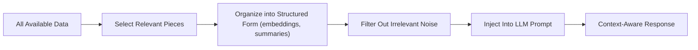
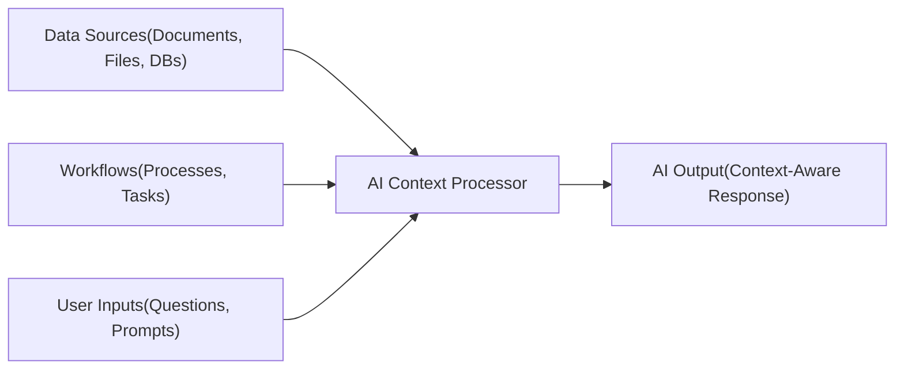

## Overview

AI Context is all the **background information** an AI system needs in order to truly understand the task at hand. It's not just the words you type in the chat box, It’s the background information, data, and environment that shape how the AI interprets your request and decides what to do next.

Without context, **AI works in isolation**. It may give you an answer, but often it’s generic or disconnected from your actual needs. They might still respond, but often in a way that feels disconnected or too generic, because they’re essentially **guessing** without the bigger picture.

## The Human Analogy

Now, think about how humans solve problems. If you ask someone a question without any background details, they’ll give you a very **surface-level response**. But if you provide them with the necessary background like your documents, past conversations, specific goals, or the processes you’re following and so on they immediately become more effective. They don’t just answer the question; they give you an **answer that fits your situation**. AI works in exactly the same way.

## What is AI Context Engineering?

**AI Context Engineering** is the process of making sure the AI has the **right information at the right time**. Instead of dumping everything into the model, it’s about carefully curating what matters.

This involves:
- Picking out relevant inputs (files, history, databases).
- Structuring data so it’s easy for the AI to digest.
- Filtering noise that could distract or confuse.
- Delivering that streamlined context directly into the LLM.

> **In short :** context engineering is about being intentional. It’s like preparing briefing notes for someone before a meeting, not too little, **not too much**, just what they need.

## How Context Engineering Works:

**Explanation**: Raw data isn’t fed straight into the AI. Instead, it’s **trimmed down**, **organized**, and **shaped** before being passed along, that’s the engineering part.

## Why context matters for AI?

By supplying AI with the right context such as your files, databases, workflows, or prior interactions, you give it the “**missing puzzle pieces**” it needs. Without extra systems, every chat starts from zero. Adding memory and context changes that:

- **Short-Term Memory**: keeps track of the current conversation.
- **Long-Term Memory**: taps into past chats, documents, or external knowledge bases.
- **Context Manager**: decides which bits are useful right now.

 With those in place, the AI can build on what you've already shared.

## How AI Context flows

## Real-World Example:

**Healthcare Chatbot**:
Imagine a patient using an AI-powered health assistant.

**Without context** :
The patient types “I feel dizzy”
The bot responds with a generic explanation about possible causes of dizziness.

**With context** :
The bot remembers that yesterday the patient reported “high blood pressure” and is on “medication X.”
It connects the dots and provides a safer, more personalized response:

> “Since you mentioned high blood pressure yesterday, dizziness may be related to your medication. Please consult your doctor immediately.”

👉 This shows how context turns a basic Q&A system into a useful, personalized assistant.

## Benefits of providing AI Context

- **Reason more effectively** instead of making blind guesses.
- **Adapt to your unique situation** rather than providing one-size-fits-all outputs.
- **Deliver actionable results** that save you time and effort.
- **Continuously improve** its usefulness as it learns from richer context over time.

## Conclusion

Context transforms AI from a **tool that just talks at you** into a partner that truly works with you. It shifts the AI from being a general-purpose assistant into becoming a **knowledgeable collaborator** that understands your data, your workflow, and your goals, helping you solve the right problems with the right knowledge.

