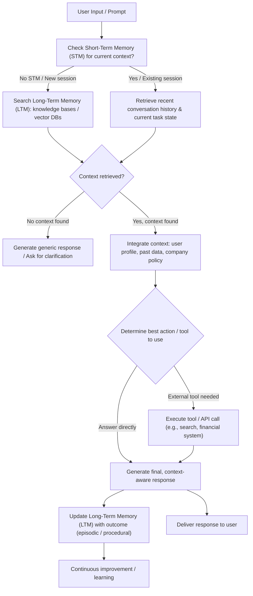

## Overview

An **AI agent without context** is a **reactive system**, it resets its knowledge base after every query. Think of it like hiring a brilliant consultant who suffers from constant short-term memory loss, they’ll give you a technically correct answer based only on your last sentence, but it will often be irrelevant, incomplete, or inappropriate because they don't remember the previous conversation, your business rules, or your long-term goals.

**AI Context and Memory** transform this reactive system into a **proactive, goal-oriented partner**. Context is the proprietary information your documents, customer history, business workflows, and environmental data that an agent accesses via its memory architecture (Source: [IBM on AI Agent Memory](https://www.ibm.com/think/topics/ai-agent-memory)).

### Key Components of Contextual AI: The Memory Architecture

Context is enabled by a multi-layered memory system:

1.  **Short-Term Memory (STM):** Maintains the coherence of the current conversation (like a small, rolling buffer).
2.  **Long-Term Memory (LTM):** Stores persistent knowledge across sessions, categorized as:
    * **Episodic Memory:** Specific past events and interactions (e.g., a customer's past support tickets).
    * **Semantic Memory:** General facts, rules, and company policies (e.g., a bank's fraud detection rules).
    * **Procedural Memory:** Learned multi-step workflows (e.g., the correct sequence to process a loan).

## Why Context Matters?

-   **Understand Specific Needs:** The agent relies on proprietary data and past interactions, not just broad, general training.
-   **Deliver Accurate and Relevant Outputs:** Responses are tailored to the user's history, goals, and company policies (e.g., compliance-checked outputs).
-   **Achieve Complex, Multi-Step Goals:** Agents can remember the state of a long-running process, avoiding repetition and maintaining focus on the ultimate objective.
-   **Integrate Seamlessly:** The agent understands and follows existing organizational procedures and data structures, using **Procedural Memory** to execute complex workflows.
-   **Enhance Personalization:** LTM allows for highly personalized interactions, whether recommending an educational resource based on past quiz failures or adjusting an autonomous vehicle's settings based on learned driver preferences.

## Without Context vs. With Context

| Sector | Scenario | AI **Without Context** (Generic Tool) | AI **With Context** (Knowledgeable Partner) |
| :--- | :--- | :--- | :--- |
| **BFSI** | **Loan Status** | Asks for Application ID repeatedly, wasting customer time. | Uses **Episodic Memory** to retrieve the loan status and proactively asks about the closing process. (Learn more: [AI Agents in BFSI](https://www.youtube.com/watch?v=sWUjxSFptBs)) |
| **Healthcare** | **Patient Check-in** | Asks the patient to fill out a new 20-page medical history form every time. | Pre-populates forms using **LTM** and confirms key details like medication status. |
| **Education** | **AI Tutoring** | Offers generic hints without tracking learning gaps. | Uses **Episodic Memory** to track failures, identifies the root concept gap (**Semantic Memory**), and generates targeted remedial material. |
| **Automobile** | **Maintenance** | Displays generic alerts, causing confusion or panic. | Accesses the vehicle's diagnostics and **Procedural Memory** (repair manual) to inform: "The oil pressure is low. I've automatically booked a service slot for tomorrow." |

## The Context-Driven Decision Cycle

The diagram below illustrates how an AI agent uses its memory systems (STM and LTM) and its reasoning to process a user's request and execute an action that is both relevant and coherent with its history.

## Conclusion

In short, context turns AI from a general assistant into a **knowledgeable partner** that works for your workflow. By incorporating a robust memory architecture, AI agents move past simple commands to perform complex, multi-step, personalized tasks, driving real operational efficiency and competitive advantage across all major industries.