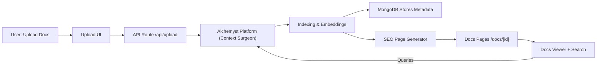
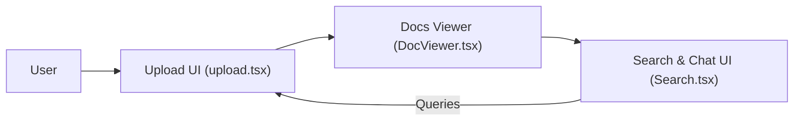
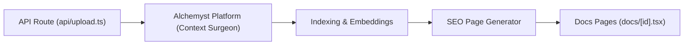
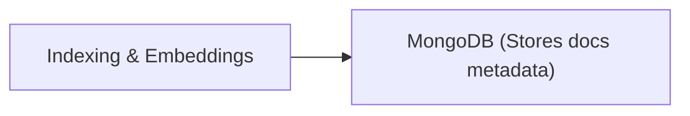

## Overview

**Zendocs** is a starter project built with **Next.js + MongoDB** that helps you put your documentation and SEO on **autopilot**.  
Instead of manually creating and maintaining docs pages, you upload your documentation, and the **Alchemyst Platform** takes care of indexing, generating SEO-friendly pages, and enabling Q&A directly from your docs.

---

## Get Started

```bash
git clone https://github.com/Alchemyst-ai/zendocs.git
cd zendocs
npm install
cp .env.example .env
npm run dev   # app starts at http://localhost:4163
```
>⚡ After setup, upload a small test file. You should see:
>- A successful request at `/api/upload` in DevTools
>- A record created in **MongoDB**
>- A new SEO-friendly page under `/docs/{id}`

---

## How It Works ?

1. **Prepare your docs** – Gather your internal documentation (text, markdown, or zipped files).  
2. **Create a MongoDB instance** – Either self-hosted or on [MongoDB Atlas](https://www.mongodb.com/atlas/database).  
3. **Sign up on [Alchemyst Platform](https://getalchemystai.com/)** – Create an account and get an [API KEY](https://platform.getalchemystai.com/settings).  
4. **Upload docs to [Context Surgeon](https://platform.getalchemystai.com/context)** – This tool indexes your documents so the AI can use them.  
5. **Set environment variables** – Copy `.env.example` → `.env` and fill in:  
   ```bash
   BACKEND_BASE_URL=https://platform-backend.getalchemystai.com
   NEXT_BACKEND_URL=http://localhost:4163   # or your deployed URL
   ```
6. **Run locally** – Start the app and you'll see your docs auto-generated with SEO pages.
7. **Ask questions** – Users can search or ask questions, and get answers powered by your docs.



---

## Environment Variables

Set these in `.env`:

```bash
ALCHEMYST_API_KEY=YOUR_ALCHEMYST_API_KEY
BACKEND_BASE_URL=YOUR_BACKEND_BASE_URL
MONGODB_URL=YOUR_MONGODB_URL
DB_NAME=YOUR_DB_NAME
DEBOUNCING_THRESHOLD=YOUR_API_DEBOUNCING_THRESHOLD_IN_MS
NEXT_APP_BACKEND_URL=http://localhost:4163
```

>⚠️ Remember to keep `.env` out of version control.
---


## Code Structure

```
Root Directory
├── .env.example                 # Environment variables template
├── .eslintrc.json              # ESLint configuration
├── .gitignore                  # Git ignore rules
├── components.json             # UI components configuration
├── next.config.mjs             # Next.js configuration
├── package.json                # Project dependencies and scripts
├── postcss.config.mjs          # PostCSS configuration
├── README.md                   # Project documentation
├── tailwind.config.ts         # Tailwind CSS configuration
├── tsconfig.json              # TypeScript configuration
│
├── .azure/                    # Azure configuration directory
├── .github/                   # GitHub configuration
│   └── workflows/
│       └── codacy.yml        # Codacy security scan workflow
│
├── collections/              # API collections
│   └── apis.http            # HTTP API examples
│
├── public/                   # Public assets
│   ├── robots.txt           # SEO robots file
│   ├── fonts/              # Font files
│   └── logo/               # Logo images
│
├── scripts/                 # Utility scripts
│   └── insert-test-docs.ts  # Script to insert test documents
│
└── src/                     # Source code
    ├── app/                 # Next.js app directory
    │   ├── api/            # API routes
    │   ├── docs/           # Documentation pages
    │   ├── layout.tsx      # Root layout
    │   ├── page.tsx        # Home page
    │   └── globals.css     # Global styles
    │
    ├── components/         # React components
    │   ├── docs/          # Documentation-specific components
    │   └── ui/            # Reusable UI components
    │
    ├── lib/               # Library code
    ├── models/            # Database models
    ├── types/             # TypeScript type definitions
    └── utils/             # Utility functions
```


--- 
## Architecture & Flow
**Zendocs** is divided into four main modules: **Frontend**, **Backend**, **Database**, and **Config**. Below is a detailed breakdown with flowcharts for each module.

### 1. Frontend
Handles user interactions, file uploads, and displaying documentation and search results.

> **Key Files**:
>- src/pages/upload.tsx – Upload UI
>- src/components/DocViewer.tsx – Displays individual docs
>- src/components/Search.tsx – Search & Q&A interface


### 2. Backend

Processes uploaded files, interacts with the Alchemyst AI platform, and generates SEO pages.

>**Key Files**:
>- src/pages/api/upload.ts – API route for uploads
>- Alchemyst Platform – Indexing & embedding service
>- Page Generator – Creates SEO-friendly pages and sitemap




### 3. Database

Stores metadata and document information for quick retrieval and search.

>**Key Files**:
>- lib/mongodb.ts – MongoDB connection helper
>- models/ – MongoDB schemas




### 4. Configuration

Environment variables manage API keys, backend URLs, and thresholds for debouncing requests.

>**Key Variables**:
```bash
ALCHEMYST_API_KEY=YOUR_API_KEY
BACKEND_BASE_URL=https://platform-backend.getalchemystai.com
MONGODB_URL=YOUR_MONGODB_URL
DB_NAME=YOUR_DB_NAME
NEXT_APP_BACKEND_URL=http://localhost:4163
DEBOUNCING_THRESHOLD=YOUR_API_DEBOUNCING_THRESHOLD_IN_MS
```

```mermaid
flowchart LR
    ENV["Environment Variables"] -.-> API["API Route"]
    ENV -.-> FE["Frontend Components"]

    ```

---
## Core Features
  ### 1. Document Generation
Generates docs from uploaded content via Alchemyst AI.
Stored in MongoDB with metadata for fast retrieval.
->`generateDocs.ts`

### 2. Document Chat
Real-time chat for a document's context.
Integrates with Alchemyst AI for intelligent responses.
-> `src/components/docs/chat-app.tsx`

### 3. Document Search
 Full-text search with filtering and ranking.
 ->`src/components/docs/doc-search.tsx`

---
## API Endpoints

### 1. Documents

- GET `/api/docs/list` – List all docs
- GET `/api/docs/[docSlug]` – Get a specific doc
- POST `/api/docs/search` – Search docs
- POST `/api/docs/generate `– Generate a new doc

### 2. Chat

- GET `/api/docs/[docSlug]/chat/history` – Get chat history
- POST `/api/docs/[docSlug]/chat/generate` – Generate chat response
---
## Benefits of using Zendocs

1. **Personalized Documentation** – Users get answers based on your uploaded docs
2. **SEO on Autopilot** – New pages are generated and added to the sitemap automatically
3. **Fast Setup** – Just connect MongoDB, add environment variables, and you're ready
---

## How to Deploy ?

### Run Locally
```bash
npm install
npm run dev     # Start dev server
npm run build   # Production build
```

### Testing

```bash
npm run insert-test-docs  # Inserts test documents
```


### Deployment

Configured for Next.js hosting platforms.
Default `port: 4163`.

---
## SEO & Performance

- Automatic sitemap generation
- Server-side rendering for better SEO
- Optimized image loading
- Response caching and metadata optimization
---
## Security

- API route protection
- MongoDB connection security
- Input validation with Zod
- XSS prevention & CORS configuration
---

<Card
    title="Github"
    icon="github"
    href="https://github.com/Alchemyst-ai/zendocs"
    horizontal
    target="_blank"
>
  Star and look at the code
</Card>