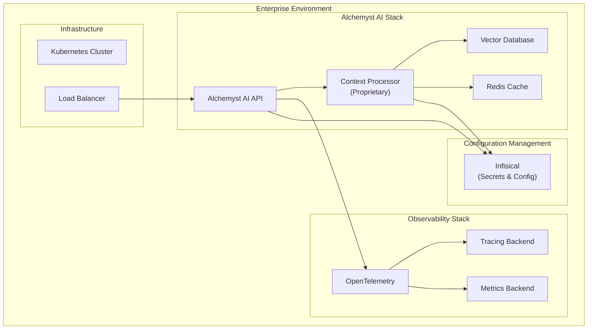

<Warning>
  This guide is intended for **enterprise customers only** who have specifically opted for self-hosting as part of their enterprise plan. If you're on a standard plan, please use our hosted API at [platform.getalchemystai.com](https://platform.getalchemystai.com).
</Warning>

## Prerequisites

Before you start, you'll need to gather several API keys and set up accounts with various services. This comprehensive guide will walk you through obtaining each required component.

### Enterprise Deployment Package

Alchemyst AI's on-premise deployment is designed for security, observability, and ease of configuration. At its core, the platform includes a proprietary Context Processor—a confidential build component responsible for advanced contextual analysis and model orchestration. This processor is delivered as a compiled artifact and does not expose internal logic or proprietary data pathways. To ensure seamless monitoring and insights, Alchemyst AI integrates with OpenTelemetry, enabling standardized observability and compatibility with popular tracing and metrics backends. Configuration and secret management are securely handled through Infisical, which provides encrypted storage and automated injection of environment variables across environments. Together, these components create a robust, transparent, and secure on-premise deployment architecture.

## Architecture Overview

## Core Components

### 1. Context Processor
- **Type**: Proprietary compiled artifact
- **Purpose**: Advanced contextual analysis and model orchestration
- **Security**: No source code exposure, compiled binary only
- **Integration**: Seamlessly connects with vector databases and caching layers

### 2. OpenTelemetry Integration
- **Purpose**: Standardized observability and monitoring
- **Features**: 
  - Distributed tracing
  - Metrics collection
  - Performance monitoring
- **Compatibility**: Works with popular backends (Jaeger, Prometheus, Grafana)

### 3. Infisical Configuration Management
- **Purpose**: Secure configuration and secret management
- **Features**:
  - Encrypted storage
  - Environment-specific configurations
  - Automated secret injection
  - Access control and audit logs

## Monitoring and Observability

### OpenTelemetry Setup

Configure your observability stack to receive telemetry data from Alchemyst AI:

### Metrics and Dashboards

Set up monitoring dashboards to track:

- **API Performance**: Request latency, throughput, error rates
- **Context Processing**: Processing time, queue depth, success rates
- **Resource Usage**: CPU, memory, disk usage
- **Business Metrics**: Active users, context additions, search queries

## Security Considerations

### 1. Network Security
- Deploy behind a reverse proxy (nginx/traefik)
- Configure SSL/TLS termination
- Set up proper firewall rules
- Use private networks for internal communication

### 2. Data Protection
- Encrypt data at rest and in transit
- Implement proper access controls
- Regular security audits
- Backup and disaster recovery procedures

### 3. Compliance
- GDPR compliance for EU customers
- SOC 2 Type II certification
- HIPAA compliance for healthcare use cases
- Custom compliance requirements

## Support and Maintenance

### Enterprise Support
- 24/7 dedicated support channel
- Priority response times
- Direct access to engineering team
- Custom SLA agreements

### Updates and Patches
- Automated security updates
- Zero-downtime deployments
- Rollback capabilities
- Change management procedures

## Getting Started

1. **Contact Sales**: Reach out to our enterprise team at [enterprise@getalchemystai.com](mailto:enterprise@getalchemystai.com)
2. **Architecture Review**: We'll review your infrastructure requirements
3. **Deployment Package**: Receive your customized deployment package
4. **Implementation**: Our team will guide you through the setup process
5. **Go Live**: Launch your self-hosted Alchemyst AI instance

<Card
    title="Enterprise Contact"
    icon="envelope"
    href="mailto:enterprise@getalchemystai.com"
    horizontal
    target="_blank"
>
  Contact our enterprise team for self-hosting options
</Card>
